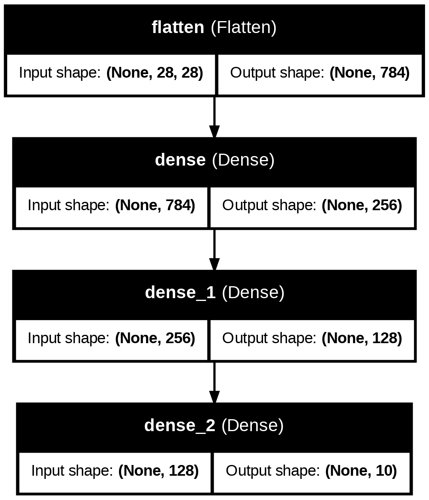

# Deep Learning Padawan

## Requierements

To be able to run the code in this repository, you can create a virtual environment and install the dependencies using the following commands:

```bash
python -m venv dl_venv
source dl_venv/bin/activate
pip install -r requirements.txt
```

## Tasks
###  Perceptron Task

The [multilayer_perceptron.ipynb](src/multilayer_perceptron.ipynb) notebook contains a comparison between the implementation of a multilayer perceptron from scratch and the one provided by Keras. The use case was to train each of the models with the MNIST dataset, which consists of 70,000 images of handwritten digits (0-9) and their corresponding labels. Each approach trained the following architecture of neural network:



One input layer with 784 neurons (28x28 pixels), two hidden layers with 128 and 64 neurons respectively, and an output layer with 10 neurons (one for each digit). The activation function used in the hidden layers was sigmoid and the output layer uses softmax.

The difference between these two implementations is that the Keras implementations has a lot more utilities that make the training process easier, such as the use of optimizers, loss functions, and metrics. It allows you to print the model summary and architecture of the network, and it also provides a lot of functionalities for saving and loading models, and for visualizing the training process.

### Application Task

The chosen application was to train a language model for translating spanish to indigenous languages. The indigenous language chosen was the Wayuunaki, the language of the Wayuu people, who are an indigenous group that inhabits the Guajira Peninsula in northern Colombia and northwestern Venezuela. 

#### Dataset Creation

The raw data can be found in the [files](src/datasets_creation/files/) folder. The dataset was created by concatenating three different datasets obtained from the following sources:
- [Tatoeba-Challenge](https://github.com/Helsinki-NLP/Tatoeba-Challenge)
- [Amaya, R.J.N.: Spanish-wayuunaki](https://es.glosbe.com/guc/es/ama)
- [OLAC Resources in and About the Wayuu Language](https://www.webonary.org/wayuu/language/map/)

Then all this information was combined to create [`spa_guc_dataset.csv`](src/datasets_creation/spa_guc/spa_guc_dataset.csv), which contains 2 columns: `spa` and `guc`. The `spa` column contains the sentences in Spanish and the `guc` column contains the corresponding translations in Wayuunaki. Then after creating the dataset this is pushed to the hub of datasets of Hugging Face.

#### Training

Transfer Learning is a useful technique that allows us to leverage the knowledge learned by a pre-trained model on a large dataset and apply it to a new task with a smaller dataset. In this case, we can used a pre-trained language model `T5-base`, which was introduced in the paper [Exploring the Limits of Trans-
fer Learning with a Unified Text-to-Text Transformer](https://jmlr.org/papers/volume21/20-074/20-074.pdf). T5 is a encoder-decoder transformer-based model that was trained on a large corpus of text data and can be fine-tuned for a variety of natural language processing tasks, including translation. 

The results of the different trainning experiments where registered in `Weights & Biases` and can be found in the following [link](https://wandb.ai/la-rodriguez-universidad-de-los-andes/Wayuu_spanish_translator?nw=nwuserlarodriguez). 

> Note: Better results could have been obtained if the dataset was larger, or with more training time, more memory and a better GPU.
